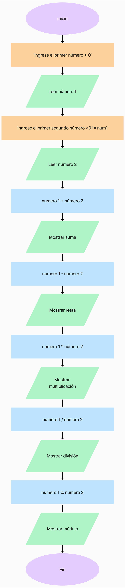

# Variables y Operadores aritméticos
 Ejercicios en Javascript aplicando variables y operadores aritméticos.

 ## Descripción
 Este documento HTML contiene un script en JavaScript que realiza varias operaciones aritméticas y conversiones de unidades solicitadas al usuario. Aquí están las secciones detalladas:

### 1. Operaciones Aritméticas Básicas:

#### Solicita dos números al usuario.
Calcula y muestra la suma, resta, multiplicación, división y módulo de los dos números.

### 2. Conversión de Temperatura:

#### Solicita una temperatura en grados Celsius al usuario.
Convierte y muestra la temperatura en grados Fahrenheit y Kelvin.

### 3. Conversión de Días:

#### Solicita una cantidad de días al usuario.
Convierte y muestra la cantidad de días en años, meses, semanas, días y horas.

### 4. Cálculos con 5 Números:

#### Solicita cinco números al usuario.
Calcula y muestra la suma y el promedio de los cinco números.

## Cómo Ejecutar
1.-Clona este repositorio o descarga los archivos.

2.-Abre el archivo `index.html` en tu navegador web.
Sigue las instrucciones que aparecen en la pantalla y proporciona los números y valores solicitados.
Observa los resultados de las operaciones y conversiones directamente en la página web.

## Diagrama de flujo de operaciones básicas.

Diagrama de flujo de la suma, resta, multiplicación, división y módulo entre dos números mayores que **0** y el segundo número, distinto del primero.

 

## Autores
- **Desarolladora:[Paloma Rivera](https://github.com/**SingularPigeon)**
- **Diseño: [Bootcamp Desafío Latam](desafiolatam.com)**